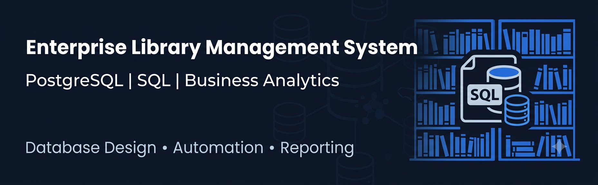
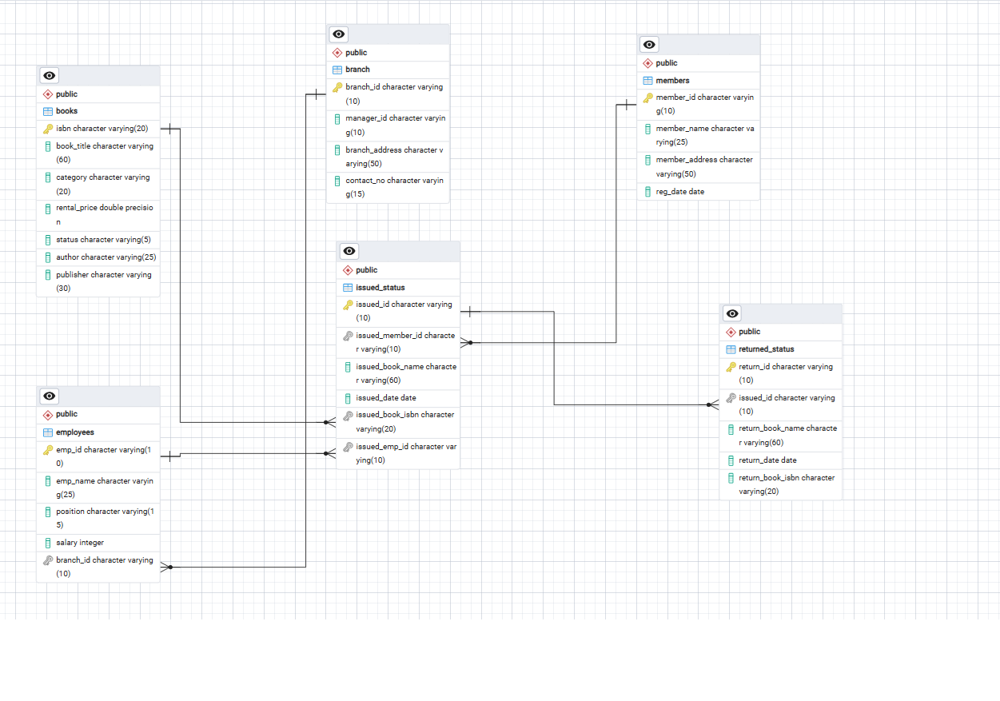

# 📚 Library Management System | PostgreSQL Database project

> Enterprise-level SQL project demonstrating relational database design, business analytics, stored procedures, reporting, and database automation using PostgreSQL.
>
<p align="center">



</p>


---

## Project Overview

| Category | Details |
|----------|---------|
| **Database** | PostgreSQL |
| **Domain** | Library Management |
| **Tables** | 6 |
| **Business Use Cases** | 20 |
| **Stored Procedures** | 2 |
| **Reporting Tables (CTAS)** | 4 |
| **ER Diagram** | Included |
| **Dataset** | CSV Files |

---

## 📊 Project Metrics

| Metric | Value |
|---------|------:|
| Database Tables | 6 |
| SQL Scripts | 9 |
| Business Use Cases | 20 |
| Stored Procedures | 2 |
| CTAS Reports | 4 |
| Foreign Key Relationships | 5 |
| CSV Datasets | 6 |

---

  ## Table of Contents

- Executive Summary
- Business Problem
- Project Objectives
- Business Value
- Technology Stack
- Database Architecture
- Entity Relationship Diagram
- Business Use Cases
- SQL Skills Demonstrated
- Project Structure
- Key Features
- Project Demonstration
- Future Enhancements
- Execution Workflow
- License

---

## Executive Summary

The Library Management System is an end-to-end relational database project developed using PostgreSQL to simulate the operations of a modern library.

The project demonstrates database design principles, relational modeling, data integrity, business reporting, and procedural SQL by managing books, members, employees, issue transactions, and return operations.

It also showcases how SQL can be used to solve real-world business problems through reporting, automation, and analytical queries.

---

## Business Problem

Libraries generate thousands of transactions involving books, members, employees, and returns.

Managing these operations manually leads to:

- Poor inventory visibility
- Difficulty tracking overdue books
- Delayed reporting
- Inconsistent member records
- Inefficient branch performance monitoring

This project addresses these challenges by developing a normalized relational database capable of supporting daily library operations and management reporting.

---

## Project Objectives

- Design a normalized relational database
- Implement relationships using Primary and Foreign Keys
- Perform CRUD operations
- Generate operational and analytical reports
- Automate business processes using Stored Procedures
- Create summary tables using CTAS
- Monitor overdue books and calculate fines
- Analyze branch-level performance

---

## 💼 Business Value

This project demonstrates how SQL can be used to support day-to-day business operations by:

- Improving inventory visibility through book availability tracking.
- Automating book issue and return processes.
- Monitoring overdue books and calculating fines.
- Measuring branch-level operational performance.
- Identifying active members and engagement trends.
- Generating management-ready reports for decision-making.

---

## Technology Stack

| Category | Technology |
|----------|------------|
| Database | PostgreSQL |
| SQL | PostgreSQL SQL |
| Database Design | pgAdmin |
| ER Diagram | pgAdmin ERD |
| Version Control | Git |
| Repository | GitHub |

---

## Database Architecture

The Library Management System follows a normalized relational database design consisting of six core entities.

| Table | Description |
|--------|-------------|
| **books** | Stores book inventory, category, rental price, and availability status. |
| **members** | Stores member registration details. |
| **employees** | Stores employee information and branch assignments. |
| **branch** | Stores branch information and branch manager details. |
| **issued_status** | Records book issue transactions. |
| **returned_status** | Records returned books and return details. |

The database is designed using Primary Keys, Foreign Keys, and referential integrity constraints to maintain data consistency.

---

## Entity Relationship Diagram

<p align="center">



</p>

The ER Diagram illustrates the relationships between books, members, employees, branches, issued books, and returned books.

---

## Business Use Cases

| Scenario | Business Objective |
|----------|--------------------|
| Add New Books | Maintain the library inventory |
| Update Member Information | Keep member records up to date |
| Remove Invalid Transactions | Maintain clean transactional data |
| Track Employee Book Issues | Monitor operational workload |
| Identify Active Members | Analyze member engagement |
| Generate Book Issue Summary | Monitor book circulation |
| Analyze Rental Revenue | Measure category-wise earnings |
| Monitor Recent Registrations | Track member acquisition |
| Identify Overdue Books | Improve return compliance |
| Automate Book Returns | Update inventory automatically |
| Branch Performance Report | Evaluate operational efficiency |
| Identify High-Risk Members | Detect repeated damaged returns |
| Automate Book Issuing | Prevent issuing unavailable books |
| Generate Overdue Fine Report | Support fine calculation and recovery |

---

## SQL Skills Demonstrated

- Database Design
- Relational Modeling
- Primary & Foreign Keys
- Constraints
- CRUD Operations
- INNER JOIN
- LEFT JOIN
- GROUP BY
- HAVING
- Aggregate Functions
- Common Table Expressions (CTEs)
- CASE Statements
- Stored Procedures
- CTAS (Create Table As Select)
- Business Reporting
- Data Analysis
- Data Integrity

---

## Project Structure

```text
library-management-system-sql
│
├── data
├── sql
├── documentation
├── assets
├── screenshots
├── LICENSE
└── README.md
```

---

## Key Features

- Normalized Relational Database Design
- Six Core Business Entities
- Referential Integrity using Foreign Keys
- Business-Oriented SQL Queries
- Stored Procedures for Process Automation
- CTAS Reporting Tables
- Branch Performance Analytics
- Overdue Book Monitoring
- Fine Calculation
- Operational Reporting

---

## What This Project Demonstrates

This project demonstrates practical experience in:

- Designing normalized relational databases
- Writing production-style SQL scripts
- Solving real-world business problems using SQL
- Developing reusable stored procedures
- Building analytical reports for business stakeholders
- Applying PostgreSQL best practices

---

## 🔄 Execution Workflow

```text
Create Database
        │
        ▼
Create Tables
        │
        ▼
Apply Constraints
        │
        ▼
Load Data
        │
        ▼
Perform CRUD Operations
        │
        ▼
Business Analysis
        │
        ▼
Business Intelligence Reports
        │
        ▼
Stored Procedures
        │
        ▼
Reporting & CTAS
```

---

## Future Enhancements

- Implement database triggers
- Develop reusable SQL functions
- Create Views for reporting
- Optimize queries using indexes
- Integrate the database with a Python application
- Build an interactive Power BI dashboard
- Develop a web-based Library Management application

---

## Project Status

**Status:** Completed

This project will continue to evolve with additional SQL optimization, indexing strategies, database triggers, reporting views, and Power BI integration.
